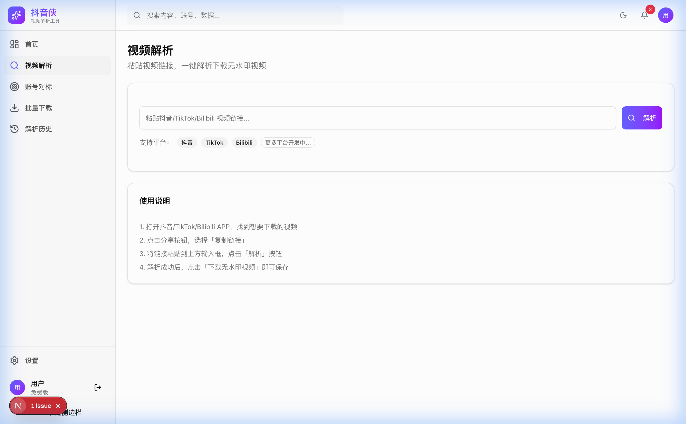

# 🎬 抖音侠 DouyinMan

> 多平台短视频解析工具 - 支持抖音/TikTok/Bilibili

---

## ✨ 功能特性

### 🎥 视频解析
- 支持抖音/TikTok/Bilibili 短链接和分享文案
- 无水印视频下载
- 视频信息提取（标题、作者、点赞、评论等）

### 📊 账号对标
- 添加竞品账号进行数据监控
- 查看账号作品列表
- 数据持久化存储

### 📦 批量下载
- 批量添加视频链接
- 下载队列管理
- 解析历史记录

---

## 🖼️ 界面预览

### 首页仪表盘

### 视频解析

### 账号对标

---

## 🛠️ 技术栈

| 技术 | 说明 |
|------|------|
| **Next.js 15** | React 框架 |
| **TypeScript** | 类型安全 |
| **Tailwind CSS** | 样式方案 |
| **Shadcn/ui** | UI 组件库 |
| **Prisma** | ORM 数据库 |
| **PostgreSQL** | 数据存储 |

---

## 📄 License

MIT License © 2026

---

## 🔗 联系方式

- 🐦 Twitter: [@caspianchan31](https://twitter.com/caspianchan31)
